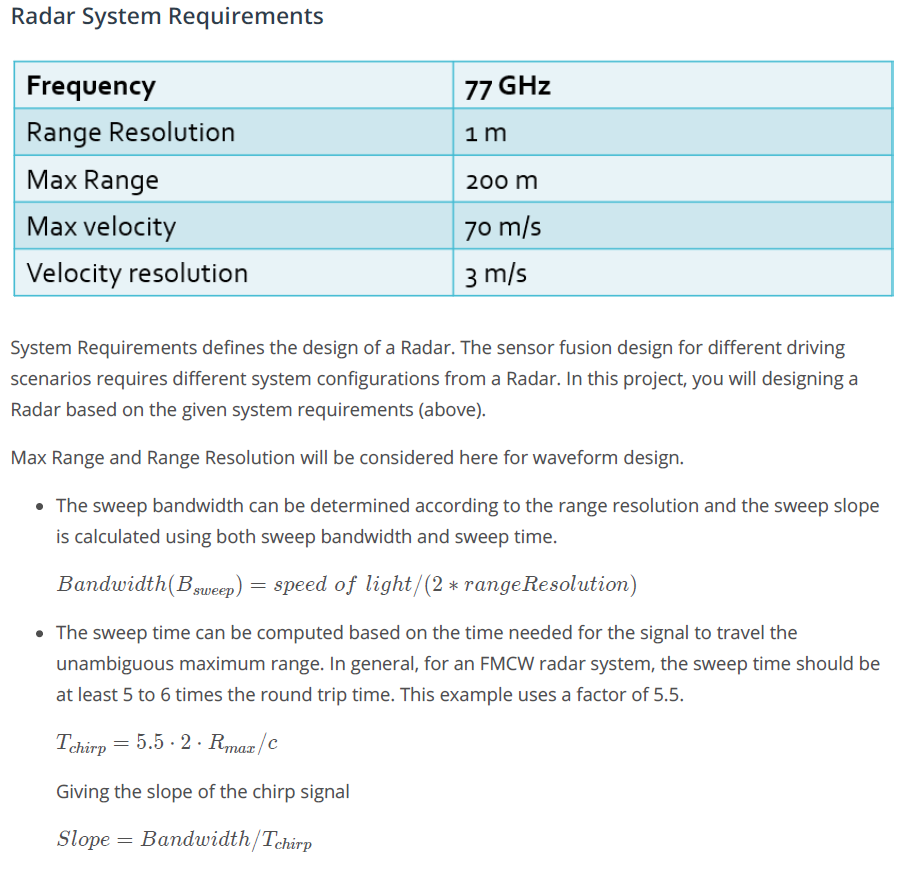
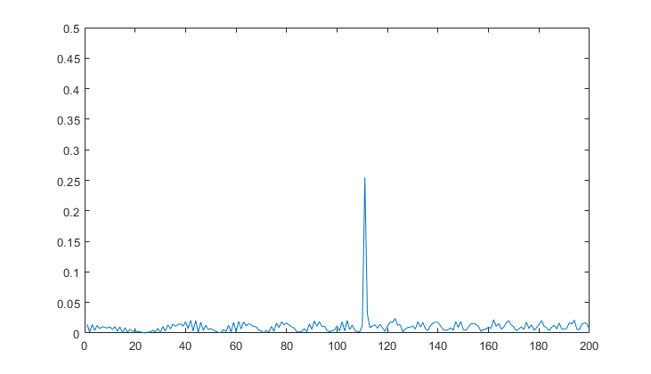
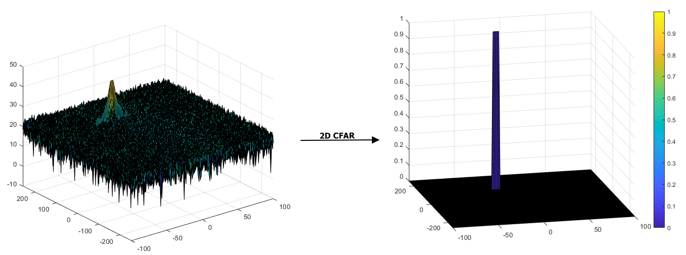
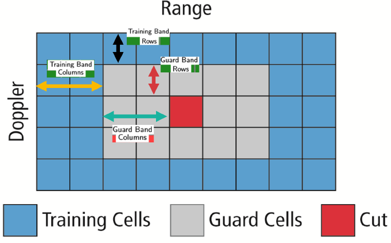

# SFND_Radar_Final

## Final Project : Radar Target Generation and Detection
***
### FP.1 FMCW Waveform Design
Using the given system requirements, design a FMCW waveform. Find its Bandwidth (B), chirp time (Tchirp) and slope of the chirp.
For given system requirements the calculated slope should be around 2e13

    %% Radar Specifications 
    %%%%%%%%%%%%%%%%%%%%%%%%%%%
    % Frequency of operation = 77GHz
    % Max Range = 200m
    % Range Resolution = 1 m
    % Max Velocity = 100 m/s
    %%%%%%%%%%%%%%%%%%%%%%%%%%%
    % speed of light = 3e8
    
    %% FMCW Waveform Generation
    % *%TODO* :
    % Design the FMCW waveform by giving the specs of each of its parameters.
    % Calculate the Bandwidth (B), Chirp Time (Tchirp) and Slope (slope) of the FMCW
    % chirp using the requirements above.

    R_max = 200; c = 3e8; 
    rangeResolution = 1; 
    Tchirp = 5.5 * (2*R_max/c);
    B = c/(2*rangeResolution); 
    slope = B/Tchirp;

    % Operating carrier frequency of Radar 
    fc = 77e9;             %carrier freq

    % The number of chirps in one sequence. Its ideal to have 2^ value for the ease of running the FFT
    % for Doppler Estimation. 
    Nd = 128;                   % # of doppler cells = # of sent periods = # of chirps

    % The number of samples on each chirp. 
    Nr = 1024;                  % for length of time = # of range cells

    % Timestamp for running the displacement scenario fo  r every sample on each
    % chirp
    t = linspace(0,Nd*Tchirp,Nr*Nd); % total time for samples... linspace(x1,x2,n)

    % Creating the vectors for Tx, Rx and Mix based on the total samples input.
    Tx = zeros(1,length(t)); % transmitted signal
    Rx = zeros(1,length(t)); % received signal
    Mix = zeros(1,length(t)); % beat signal

    % Similar vectors for range_covered and time delay.
    r_t = zeros(1,length(t));
    td = zeros(1,length(t));
***    
### FP.2 Simulation Loop
Simulate Target movement and calculate the beat or mixed signal for every timestamp. A beat signal should be generated such that once range FFT implemented, it gives the correct range i.e the initial position of target assigned with an error margin of +/- 10 meters.

    %% Signal generation and Moving Target simulation
    % Running the radar scenario over the time. 

    for i=1:length(t)         

        % *%TODO* :
        % For each time stamp update the Range of the Target for constant velocity. 
        r_t(i) = R_target + v_target*t(i);
        td(i) = 2*r_t(i)/c;

        % *%TODO* :
        % For each time sample we need update the transmitted and
        % received signal. 
        Tx(i) = cos(2*pi*(fc*t(i) + slope*t(i)^2/2)); 
        Rx(i) = cos(2*pi*(fc*(t(i)-td(i)) + slope*(t(i)-td(i))^2/2));

        % *%TODO* :
        %Now by mixing the Transmit and Receive generate the beat signal
        %This is done by element wise matrix multiplication of Transmit and
        %Receiver Signal
        Mix(i) = Tx(i)*Rx(i);

    end
***    
### FP.3 Range FFT (1st FFT)
Implement the Range FFT on the Beat or Mixed Signal and plot the result. A correct implementation should generate a peak at the correct range, i.e the initial position of target assigned with an error margin of +/- 10 meters.

    %% RANGE MEASUREMENT

     % *%TODO* :
    % reshape the vector into Nr*Nd array. Nr and Nd here would also define the size of
    % Range and Doppler FFT respectively.
    Mix = reshape(Mix, [Nr, Nd]);

     % *%TODO* :
    % run the FFT on the beat signal along the range bins dimension (Nr) and
    % normalize.
    signal_fft = fft(Mix, Nr, 1);

     % *%TODO* :
    % Take the absolute value of FFT output
    P2 = abs(signal_fft/Nr);

     % *%TODO* :
    % Output of FFT is double sided signal, but we are interested in only one side of the spectrum.
    % Hence we throw out half of the samples.
    P1  = P2(1:Nr/2,:);

    %plotting the range
    figure ('Name','Range from First FFT')
    subplot(2,1,1)

     % *%TODO* :
     % plot FFT output 
    plot(P1(:,1)); 
    axis ([0 200 0 0.5]);
***
### (Reference) 2nd FFT
    %% RANGE DOPPLER RESPONSE
    % The 2D FFT implementation is already provided here. This will run a 2DFFT
    % on the mixed signal (beat signal) output and generate a range doppler
    % map.You will implement CFAR on the generated RDM

    % Range Doppler Map Generation.

    % The output of the 2D FFT is an image that has reponse in the range and
    % doppler FFT bins. So, it is important to convert the axis from bin sizes
    % to range and doppler based on their Max values.

    % Mix=reshape(Mix,[Nr,Nd]);

    % 2D FFT using the FFT size for both dimensions.
    sig_fft2 = fft2(Mix, Nr, Nd);

    % Taking just one side of signal from Range dimension.
    sig_fft2 = sig_fft2(1:Nr/2, 1:Nd);
    sig_fft2 = fftshift(sig_fft2);
    RDM = abs(sig_fft2);
    RDM = 10*log10(RDM) ;

    %use the surf function to plot the output of 2DFFT and to show axis in both
    %dimensions
    doppler_axis = linspace(-100,100,Nd);
    range_axis = linspace(-200,200,Nr/2)*((Nr/2)/400);
    figure,surf(doppler_axis,range_axis,RDM);
***
### FP.4 2D CFAR
Implement the 2D CFAR process on the output of 2D FFT operation, i.e the Range Doppler Map. The 2D CFAR processing should be able to suppress the noise and separate the target signal. The output should match the image shared in walkthrough.

#### Implementation steps for the 2D CFAR process.

1. Determine the number of Training cells for each dimension Tr and Td. Similarly, pick the number
of guard cells Gr and Gd.
2. Slide the Cell Under Test (CUT) across the complete cell matrix
3. Select the grid that includes the training, guard and test cells. Grid Size = (2Tr+2Gr+1)(2Td+2Gd+1).
4. The total number of cells in the guard region and cell under test. (2Gr+1)(2Gd+1).
5. This gives the Training Cells : (2Tr+2Gr+1)(2Td+2Gd+1) - (2Gr+1)(2Gd+1)
6. Measure and average the noise across all the training cells. This gives the threshold
7. Add the o􀃗set (if in signal strength in dB) to the threshold to keep the false alarm to the
minimum.
8. Determine the signal level at the Cell Under Test.
9. If the CUT signal level is greater than the Threshold, assign a value of 1, else equate it to zero.
10. Since the cell under test are not located at the edges, due to the training cells occupying the
edges, we suppress the edges to zero. Any cell value that is neither 1 nor a 0, assign it a zero.
        
#### Selection of Training, Guard cells and offset.

 * Select the number of Training Cells(**Tr(range dim) and Td(doppler dim)**) 
 * Select the number of Guard Cells(**Gr(range dim) and Gd(doppler dim)**) around the Cell under test (CUT) for accurate estimation.
 * Select offset for the threshold of noise value.

         % *%TODO* :
        % Select the number of Training Cells in both the dimensions.
        %%% Nr = 1024, Nd = 128
        Tr = 10; 
        Td = 8;

        % *%TODO* :
        % Select the number of Guard Cells in both dimensions around the Cell under 
        % test (CUT) for accurate estimation
        Gr = 5;
        Gd = 4;

        % *%TODO* :
        % offset the threshold by SNR value in dB
        offset = 3.6;

        % *%TODO* :
        % Create a vector to store noise_level for each iteration on training cells
        noise_level = zeros(1,1);
        
#### Steps taken to suppress the non-thresholded cells at the edges.

    % *%TODO* :
    % The process above will generate a thresholded block, which is smaller 
    % than the Range Doppler Map as the CUT cannot be located at the edges of
    % matrix. Hence,few cells will not be thresholded. To keep the map size same
    % set those values to 0. 

    RDM(RDM ~= 1 & RDM ~= 0) = 0;
    
#### Full codes of 2D CFAR

    %% CFAR implementation

    % Slide Window through the complete Range Doppler Map

    % *%TODO* :
    % Select the number of Training Cells in both the dimensions.
    %%% Nr = 1024, Nd = 128
    Tr = 10; 
    Td = 8;

    % *%TODO* :
    % Select the number of Guard Cells in both dimensions around the Cell under 
    % test (CUT) for accurate estimation
    Gr = 5;
    Gd = 4;

    % *%TODO* :
    % offset the threshold by SNR value in dB
    offset = 3.6;

    % *%TODO* :
    % Create a vector to store noise_level for each iteration on training cells
    noise_level = zeros(1,1);

    % *%TODO* :
    % design a loop such that it slides the CUT across range doppler map by
    % giving margins at the edges for Training and Guard Cells.
    % For every iteration sum the signal level within all the training
    % cells. To sum convert the value from logarithmic to linear using db2pow
    % function. Average the summed values for all of the training
    % cells used. After averaging convert it back to logarithimic using pow2db.
    % Further add the offset to it to determine the threshold. Next, compare the
    % signal under CUT with this threshold. If the CUT level > threshold assign
    % it a value of 1, else equate it to 0.

    RDM = RDM/max(RDM(:)); % normalize

    numTrainingCell = (2*Td+2*Gd+1)*(2*Tr+2*Gr+1) - (2*Gd+1)*(2*Gr+1);
    Nr = Nr/2;
    for i = Tr+Gr+1:Nr-(Tr+Gr)
        for j = Td+Gd+1:Nd-(Td+Gd)

            for p = i-(Gr+Tr):i+(Gr+Tr)
                for q = j-(Gd+Td):j+(Gd+Td)
                    if (abs(i-p) > Gr || abs(j-q) > Gd)
                        noise_level = noise_level + db2pow(RDM(p,q));
                    end
                end
            end

            noise_level = pow2db(noise_level / numTrainingCell);
            threshold = noise_level * offset;
            CUT = RDM(i,j);
            if (CUT < threshold)
                RDM(i,j) = 0;
            else
                RDM(i,j) = 1;
            end        

            noise_level = zeros(1,1);        
        end
    end

    % *%TODO* :
    % The process above will generate a thresholded block, which is smaller 
    % than the Range Doppler Map as the CUT cannot be located at the edges of
    % matrix. Hence,few cells will not be thresholded. To keep the map size same
    % set those values to 0. 

    RDM(RDM ~= 1 & RDM ~= 0) = 0;

    % *%TODO* :
    %display the CFAR output using the Surf function like we did for Range
    %Doppler Response output.
    figure,surf(doppler_axis,range_axis, RDM);
    colorbar;
